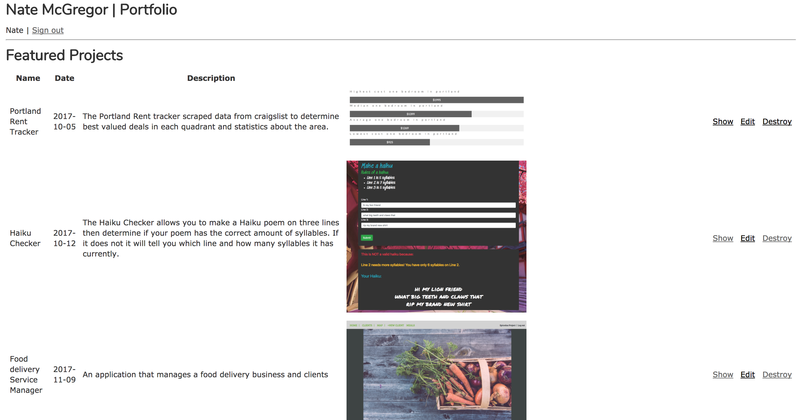

# Portfolio


### Description
_This application is a portfolio site made with Rails. As an admin you are able to add new projects to the projects list and update or delete them. Projects can have many tags as well._

### setup

Clone this repo by running ` git clone https://github.com/hal2814/rails-portfolio.git `

then run
```
cd rails-portfolio
rails db:create
rails db:migrate
rails db:seed

```
then ` rails s ` and go to `localhost:3000` in your browser




copyright Nate McGregor 2017
